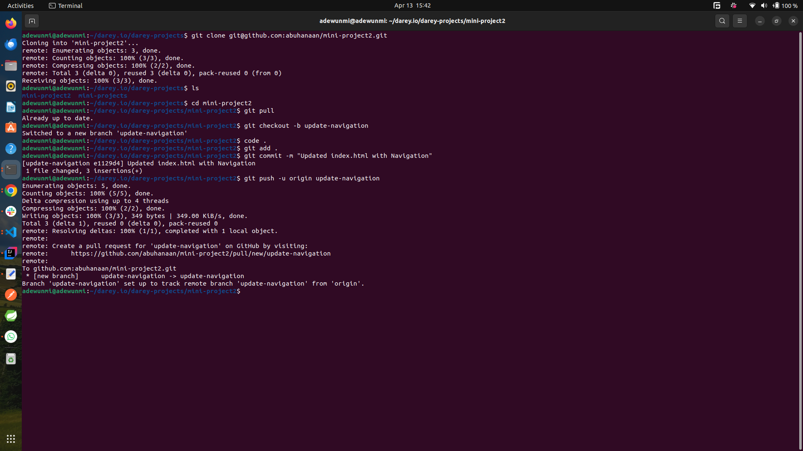
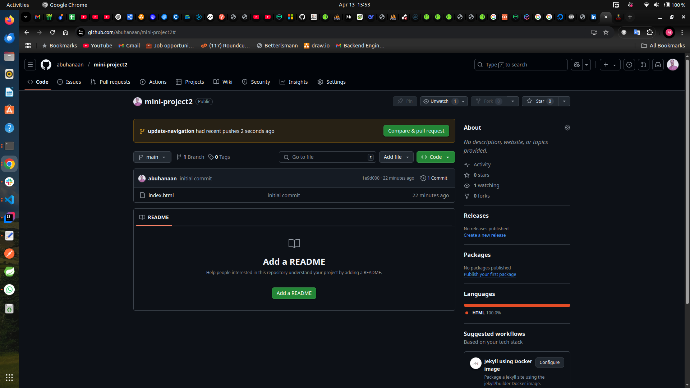
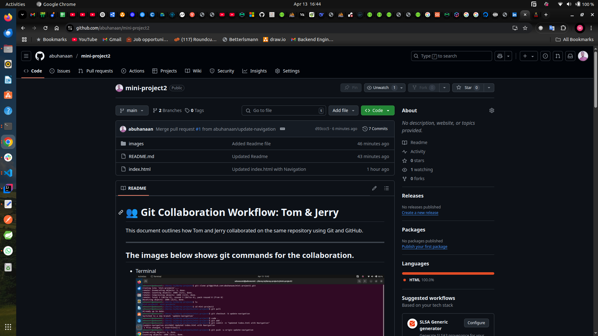
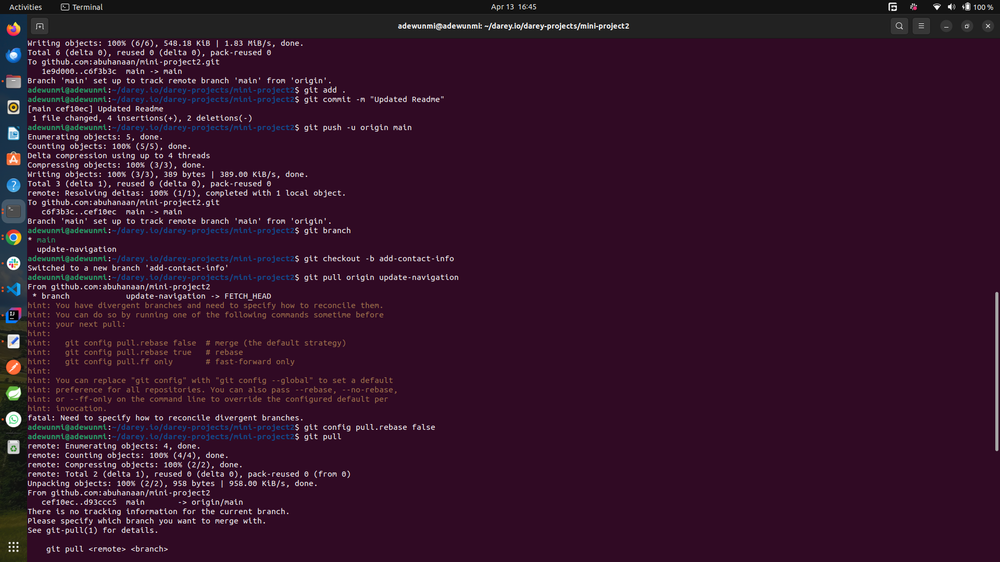
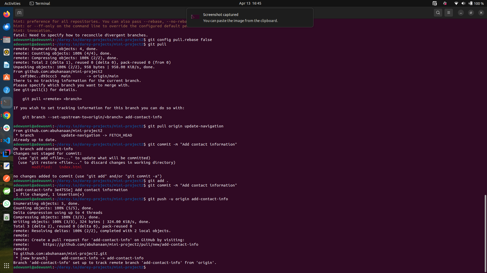
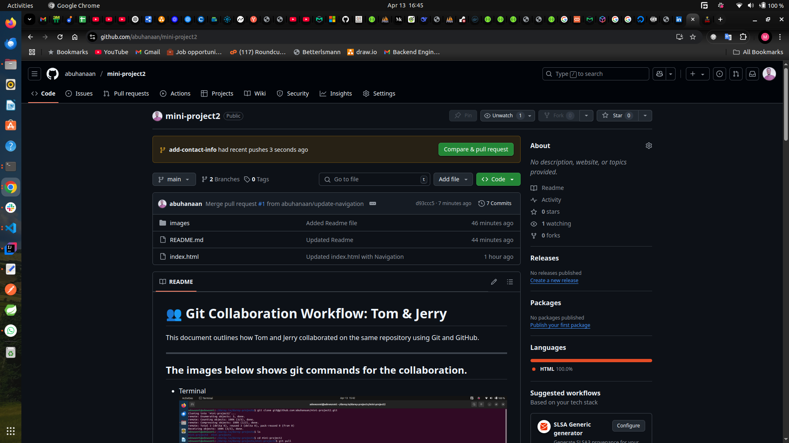

# 👥 Git Collaboration Workflow: Tom & Jerry

This document outlines how Tom and Jerry collaborated on the same repository using Git and GitHub.

---

## The images below shows git commands for the collaboration.

- Terminal
  

- Github Repo
  

- The screen below show github page after merging update-navigation branch to main branch
  

- The screen-shots below illustrates simulation of Jerry's collaboration by creating a new branch called `add-contact-info`, making changes to the branch and eventually commiting and pushing to the remote repository
  



- The screen-shot below shows the github repo page after changes have been pushed to the `add-contact-info` branch
  

## The steps below show how Tom and Jerry Collaborate Together

## 🔄 Step 1: Clone the Repository

Both Tom and Jerry clone the remote repository to their local machines to ensure they have the latest version of the codebase.

```bash
git clone https://github.com/your-org/your-repo.git
cd your-repo
```

---

## 🌿 Step 2: Create Feature Branches

Each engineer creates a new branch from the `main` branch to work on their respective features.

### Tom:

```bash
git checkout -b update-navigation
```

### Jerry:

```bash
git checkout -b add-contact-info
```

---

## ✍️ Step 3: Make Changes

- **Tom** updates the **navigation bar** in `index.html`.
- **Jerry** adds **contact information** to the **footer** of `index.html`.

---

## ✅ Step 4: Stage and Commit Changes

Each engineer stages and commits their changes locally.

### Tom:

```bash
git add index.html
git commit -m "Update navigation bar in index.html"
```

### Jerry:

```bash
git add index.html
git commit -m "Add contact info to footer in index.html"
```

---

## 🚀 Step 5: Push Feature Branches to Remote

Each engineer pushes their respective feature branches to the remote repository.

### Tom:

```bash
git push origin update-navigation
```

### Jerry:

```bash
git push origin add-contact-info
```

---

## 🔁 Step 6: Create Pull Request for Tom's Branch

- Tom opens a **Pull Request (PR)** for `update-navigation` into the `main` branch.
- The team reviews and **merges** Tom's PR into `main`.

---

## 🔄 Step 7: Jerry Syncs with Latest Main

Jerry updates his local branch with the latest changes from the `main` branch (which now includes Tom’s updates).

```bash
git checkout add-contact-info
git fetch origin
git merge origin/main
```

> 🔧 If there are merge conflicts (likely in `index.html`), Jerry resolves them manually.

---

## 💾 Step 8: Commit Conflict Resolutions

After resolving any merge conflicts:

```bash
git add index.html
git commit -m "Resolve merge conflicts with main"
```

---

## ⬆️ Step 9: Push Updated Branch

Jerry pushes the updated branch to the remote repository.

```bash
git push origin add-contact-info
```

---

## ✅ Step 10: Final PR and Merge

- Jerry creates a **Pull Request** for `add-contact-info`.
- The team reviews, approves, and **merges** the changes into the `main` branch.

---

## 🏁 Done!

Tom and Jerry have successfully collaborated on the same file using a proper Git workflow, ensuring minimal conflicts and a smooth integration process.
