# This Documentation Illustrates Pull Request Creation For Tom And Jerry's Collaboration

## The images below shows git commands for branching between tom and jerry's branches, commiting changes, pulling updates from repo and merging branches together.

- Terminal
  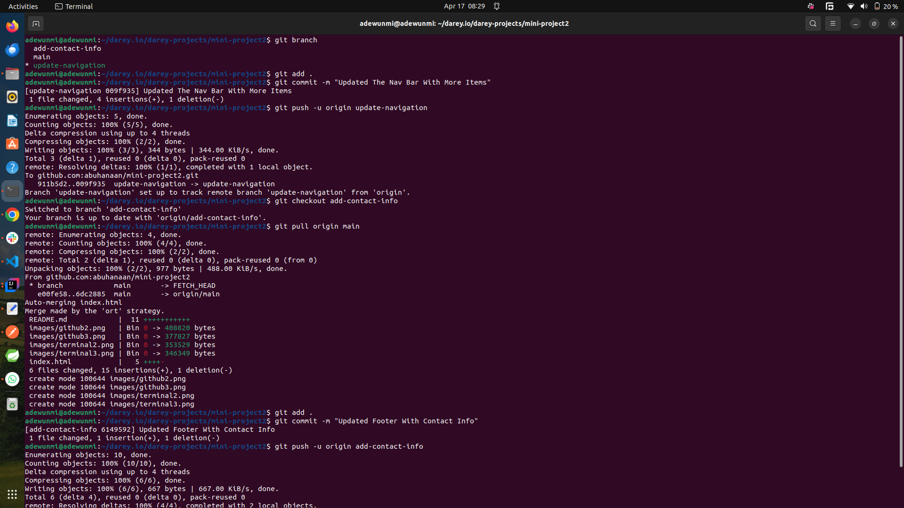
  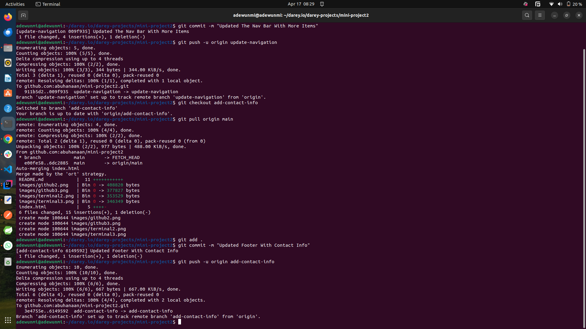

## The images below depict PR creation for the update-navigation branch

- PR for update-navigation branch
  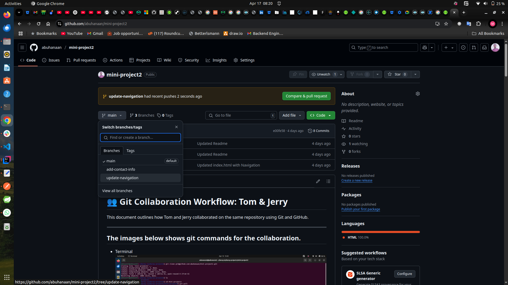
  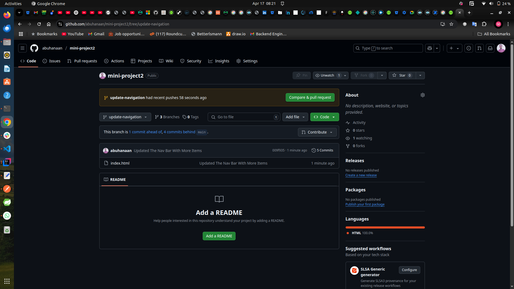
  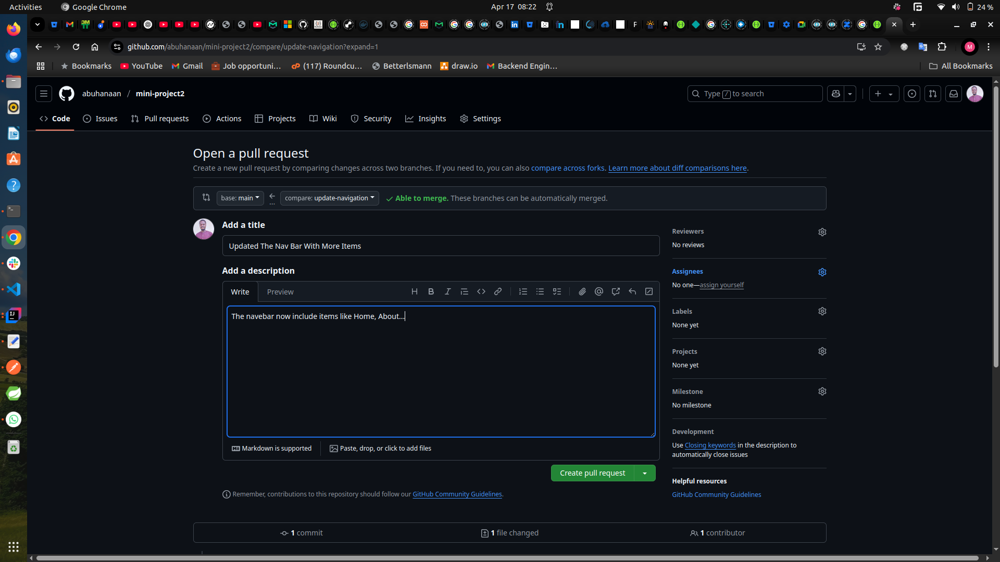
  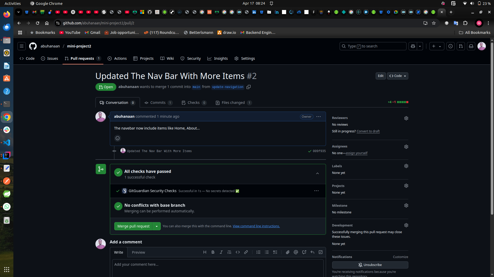
  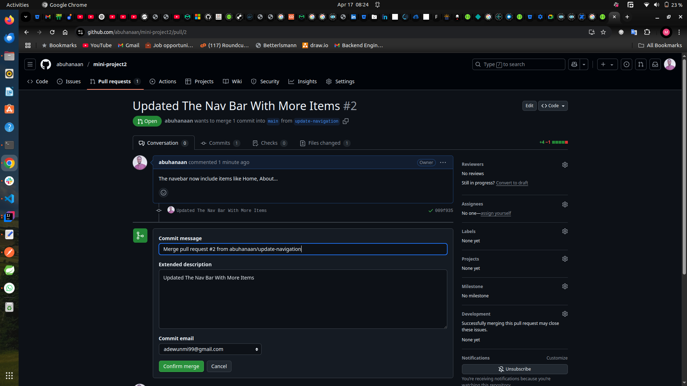
  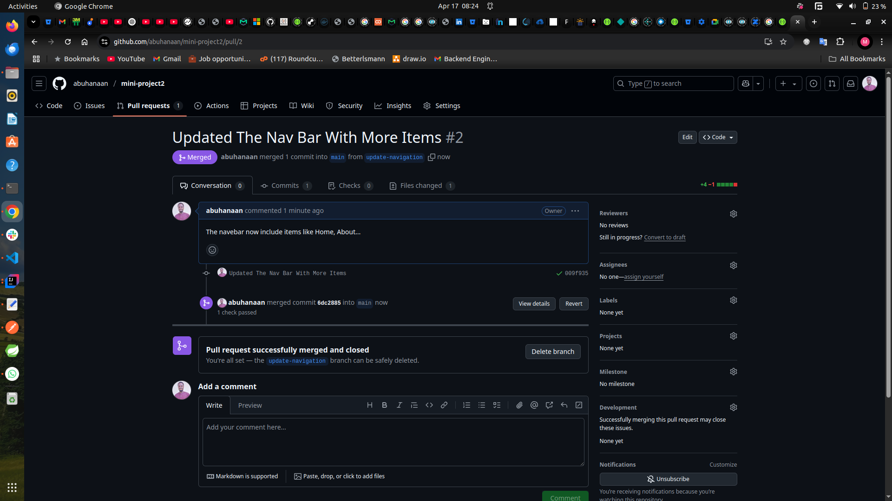

## The images below depicts the terminal prompt for merging main branch to add-contact-info branch

## The images below depict PR creation for the update-navigation branch

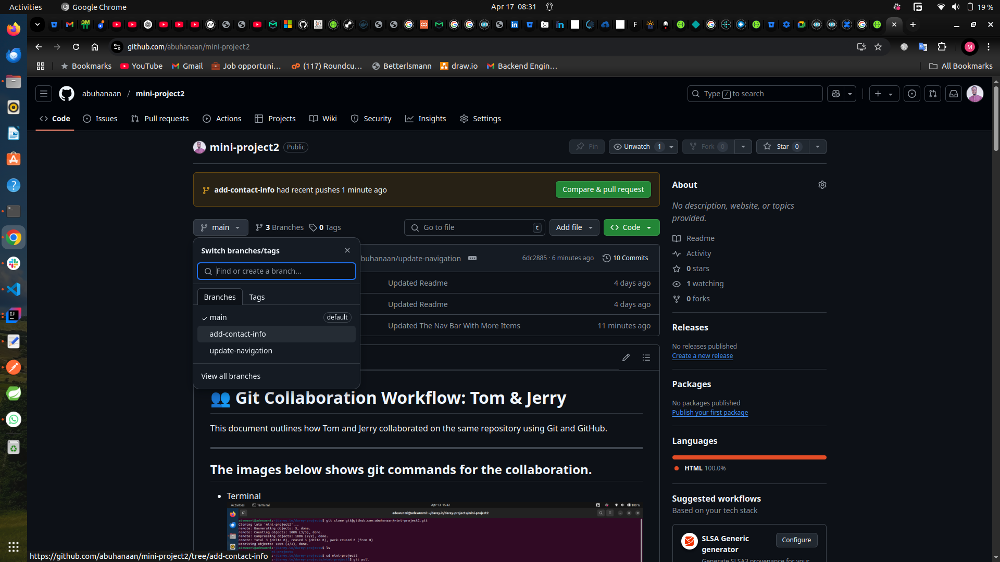
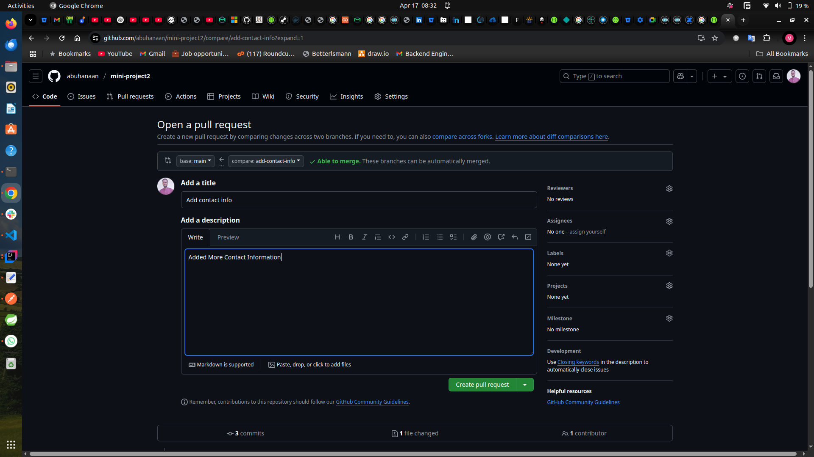
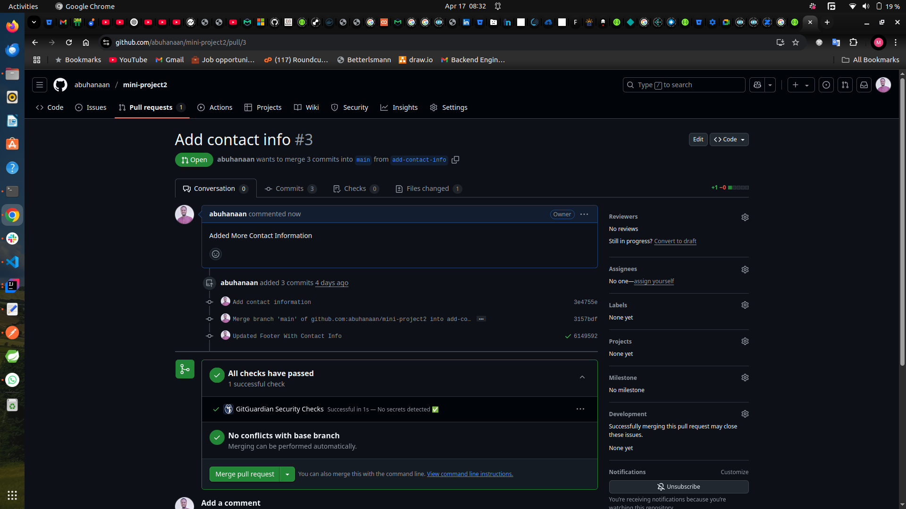
